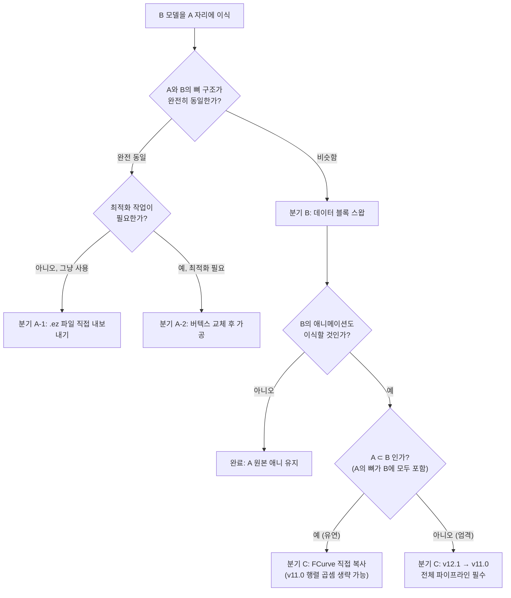

# 요괴워치 2 × 뿌니뿌니 에셋 이식 — 종합 가이드

> **대상 툴**: Blender 3.6 LTS (Python 3.10)  
> **대상 게임**: 요괴워치 2 (3DS)  
> **소스 게임**: 요괴워치 뿌니뿌니 (Mobile)

---

## 준비물

### 소프트웨어

| 항목 | 버전 | 용도 |
|------|------|------|
| **Blender** | 3.6 LTS | 3D 편집의 핵심 |
| **studio_eleven** | [1.2.0](https://github.com/Tiniifan/studio_eleven/releases/tag/1.2.0) | XPCK/XMTN 임포트·익스포트 |
| **blender-ymd-io** | [최신](https://github.com/hinadevi/blender-ymd-io) | .ez(뿌니) 임포트 전용 |
| **Kuriimu2** | [최신](https://github.com/FanTranslatorsInternational/Kuriimu2) | XC 아카이브 편집 |
| **Metanoia(선택)** | 최신 | 모델/애니메이션 미리보기 |
| **Citra 에뮬레이터** 또는 **모딩된 3DS** | — | 인게임 테스트 |

### 파일

| 항목 | 설명 |
|------|------|
| A 원본 `{id}_p00.xc` | 교체 대상 캐릭터의 모델 파일 |
| A 원본 `{id}_p20.xc` | 교체 대상 캐릭터의 애니메이션 파일 |
| B 뿌니 `.ez` 파일 | 이식할 뿌니뿌니 캐릭터 에셋 |

### Blender 애드온 설치

1. Blender 열기 → **Edit** (상단 메뉴바 좌측) → **Preferences** (⚙️ 아이콘)
2. 좌측 탭에서 **Add-ons** 선택
3. 우측 상단 **Install…** 버튼 클릭 (📂 폴더 아이콘 옆)
4. 다운로드 받은 `.zip` 파일 선택 → **Install Add-on** 클릭
5. 설치 후 체크박스 ☑️ 활성화
6. studio_eleven, blender-ymd-io 둘 다 설치
<details>
<summary>만약 'No module named Crypto' 에러로 Add-on이 활성화되지 않는 경우 해결법 (Python 코드)</summary>

다음 코드를 터미널(cmd/powershell) 또는 Blender의 Python Console에서 순서대로 실행하세요.

```python
# pip가 설치되어 있지 않은 경우, ensurepip로 설치
try:
    import pip
except ImportError:
    import ensurepip
    ensurepip.bootstrap()

# pycryptodome 설치 (Crypto 모듈 제공)
import subprocess
import sys

subprocess.check_call([sys.executable, "-m", "pip", "install", "pycryptodome"])
```

- Blender를 완전히 종료 후 다시 실행하면 문제가 해결될 수 있습니다.
- 여전히 오류가 발생한다면, Blender가 사용하는 Python 경로에 정상적으로 설치되었는지 확인하세요:  
  (Edit → Preferences → System → "Python Directory"에서 경로 확인)

</details>


## 3DS 하드웨어 한계 & 모델 최적화

### PICA200 GPU 스펙

| 항목 | 수치 |
|------|------|
| GPU | DMP PICA200 @ 268MHz |
| 초당 폴리곤 | ~15.3M (이론치) |
| **프레임당 폴리곤** (60fps) | **~127,500** (눈 하나 기준) |
| **프레임당 폴리곤** (30fps) | **~255,000** |
| VRAM | **6 MB** |
| 시스템 RAM (게임용) | ~96 MB |
| 화면 해상도 | 400×240 (상단) |

### 프랜차이즈별 캐릭터 모델 비교

| 게임 | 캐릭터 폴리곤 | 텍스처 크기 |
|------|-------------|-----------|
| 포켓몬 X/Y, 선/문 | 3,000~8,000 | 128~512px |
| 요괴워치 2 | 2,000~5,000 | 256~512px |
| 몬스터헌터 XX | 5,000~15,000 | 256~512px |
| 젤다 시간의 오카리나 3D | 3,000~10,000 | 256px |

### 최적화 가이드라인

| 항목 | 안전 범위 | 최대 | 주의사항 |
|------|----------|------|---------|
| **캐릭터 폴리곤** | 2,000~5,000 | ~10,000 | 전투 화면에 최대 6체 동시 표시 |
| **텍스처 크기** | 256×256 | 512×512 | VRAM 6MB 내에 모든 에셋 포함 |
| **텍스처 포맷** | RGB565 | — | 무조건 이 형식 유지 |
| **뼈 개수** | 원본과 동일 | 30~40 | 애니메이션 호환성 유지 |
| **버텍스당 최대 웨이트** | **2~3개** | 3개 | 초과 시 인게임 폭발 |
| **버텍스 그룹** | 원본과 동일 | — | 이름 완전 일치 필수 |
| **UV 맵** | 1개 | 2개 | 원본과 이름 일치 필수 |

> [!IMPORTANT]
> 뿌니뿌니 모델은 모바일용이므로 대부분 3DS 한계 내에 있습니다. 그러나 고폴리 모델(액세서리 등)은 **Decimate Modifier** (🔻 삼각형 아이콘 → Modifiers)로 줄여야 합니다.

---

## 워크플로우 분기



---

## 분기 A — 완전 동일 뼈 구조

> **적용 조건**: A와 B의 뼈 이름·계층·개수가 100% 동일  
> **난이도**: ★☆☆☆☆  
> **예시**: 같은 게임 내 색 바리에이션 캐릭터

### A-1. 뿌니 파일 직접 내보내기 (최속 루트)

> **적용 시점**: 뼈 구조가 완전 동일하고, 별도 최적화나 가공이 필요 없을 때  
> **핵심**: Blender에서 B(.ez) 파일을 그대로 XPCK로 내보내면 끝

1. Blender에서 `File` → `Import` → `Zip(EZ)` → `.ez` 파일 임포트
2. **셰이드 스무스** 적용  
   - 3D Viewport에서 메쉬 선택 → **우클릭** → `Shade Smooth`
3. **거리로 병합** (중복 버텍스 정리)  
   - Edit Mode 진입(`Tab`) → 상단 메뉴 `Mesh` → `Clean Up` → `Merge by Distance`
4. **버텍스당 웨이트 제한합계 = 3** 설정  
   - Weight Paint Mode(`Ctrl+Tab`) → 상단 메뉴 `Weights` → `Limit Total` → Limit: **3**
5. `File` → `Export` → `Studio Eleven (.mtn, mtm ...)` → `Archive (XPCK)` → `{id}_p00.xc`
6. Kuriimu2로 원본 XC 파일에 교체
7. 모딩된 RomFS에 배치 후 Citra 또는 실기에서 확인

> 💡 뼈 구조가 완전히 동일하므로 20.xc(애니메이션)는 A 원본을 그대로 사용합니다.\
> 내보낼 때 반드시 T포즈로 내보내야 합니다. (휴식모드로 내보내야 함)

---

### A-2. 파일 준비 (최적화 루트)

> **적용 시점**: 뼈 구조는 동일하지만, 버텍스 가공·UV 정리·웨이트 최적화 등이 필요할 때

1. Kuriimu2로 A 원본 `{id}_p00.xc` 추출
2. Blender에서 `File` → `Import` → `Level-5 (studio_eleven)` → A 모델 임포트
3. 같은 Scene에 B 모델도 임포트 (.ez는 `Import` → `Zip(EZ)`)

아래 스크립트로 **이후 모든 과정을 한 번에 자동화**할 수 있습니다.  
Blender 상단 탭 **Scripting** → 텍스트 에디터에 붙여넣기 → **▶ Run Script**

```python
import bpy

# ─── 사용 전 여기만 수정하세요 ──────────────────────────────────
A_MESH_NAME     = "여기에입력"  # A 원본 메쉬 오브젝트 이름
B_MESH_NAME     = "여기에입력"  # B 뿌니 메쉬 오브젝트 이름
B_ARM_NAME      = "여기에입력"  # B 뿌니 아마튜어 이름 (없으면 "" 로 비워두세요)
NEW_UV_NAME     = "여기에입력"  # 예: DefaultLib.{id}_01_01_texproj0
NEW_MAT_NAME    = "여기에입력"  # 예: DefaultLib.{id}_01_01
# ────────────────────────────────────────────────────────────────

a_obj = bpy.data.objects.get(A_MESH_NAME)
b_obj = bpy.data.objects.get(B_MESH_NAME)

if not a_obj or not b_obj:
    print(f"❌ 오브젝트를 찾지 못했습니다. 이름을 다시 확인하세요.")
    print(f"   A: '{A_MESH_NAME}' → {'✅ 발견' if a_obj else '❌ 없음'}")
    print(f"   B: '{B_MESH_NAME}' → {'✅ 발견' if b_obj else '❌ 없음'}")
else:
    bpy.ops.object.select_all(action='DESELECT')
    bpy.context.view_layer.objects.active = b_obj
    b_obj.select_set(True)

    # 1. 셰이드 스무스
    bpy.ops.object.shade_smooth()

    # 2. 거리로 병합 (중복 버텍스 제거)
    bpy.ops.object.mode_set(mode='EDIT')
    bpy.ops.mesh.select_all(action='SELECT')
    bpy.ops.mesh.remove_doubles()
    bpy.ops.object.mode_set(mode='OBJECT')

    # 3. 버텍스당 웨이트 제한합계 = 3
    bpy.ops.object.mode_set(mode='WEIGHT_PAINT')
    bpy.ops.object.vertex_group_limit_total(limit=3)
    bpy.ops.object.vertex_group_normalize_all(lock_active=False)
    bpy.ops.object.mode_set(mode='OBJECT')

    # 4. 데이터 블록 스왑 (B 껍데기를 A에 덮어씌우기)
    a_obj.data = b_obj.data

    # 5. UV 맵 이름 정규화 (첫 번째 UV 레이어)
    if a_obj.data.uv_layers:
        a_obj.data.uv_layers[0].name = NEW_UV_NAME
        if len(a_obj.data.uv_layers) > 1:
            print(f"⚠️ UV 레이어가 {len(a_obj.data.uv_layers)}개입니다. 첫 번째만 이름을 바꿨습니다.")

    # 6. 머티리얼 이름 정규화 (첫 번째 슬롯)
    if a_obj.material_slots and a_obj.material_slots[0].material:
        a_obj.material_slots[0].material.name = NEW_MAT_NAME
        if len(a_obj.material_slots) > 1:
            print(f"⚠️ 머티리얼 슬롯이 {len(a_obj.material_slots)}개입니다. 첫 번째만 이름을 바꿨습니다.")

    # 7. 사용 완료된 B 메쉬 오브젝트 삭제
    bpy.data.objects.remove(b_obj, do_unlink=True)

    # 8. B 아마튜어 오브젝트 삭제 (지정한 경우)
    if B_ARM_NAME:
        b_arm = bpy.data.objects.get(B_ARM_NAME)
        if b_arm:
            bpy.data.objects.remove(b_arm, do_unlink=True)
        else:
            print(f"⚠️ B 아마튜어 '{B_ARM_NAME}'를 찾지 못했습니다. 수동으로 삭제하세요.")

    print("✅ 메쉬 스왑 및 규격화 완료! 이후 내보내기(A-2-4)를 진행하세요.")
```

<details>
<summary>📖 수동 진행 방법 (스크립트 없이 단계별로)</summary>

**B 모델 전처리**

4. **셰이드 스무스** 적용  
   - 3D Viewport에서 B 모델 메쉬 선택 → **우클릭** → `Shade Smooth`
5. **거리로 병합** (중복 버텍스 정리)  
   - Edit Mode 진입(`Tab`) → 상단 메뉴 `Mesh` → `Clean Up` → `Merge by Distance`
6. **버텍스당 웨이트 제한합계 = 3** 설정  
   - Weight Paint Mode(`Ctrl+Tab`) → 상단 메뉴 `Weights` → `Limit Total` → Limit: **3**

**버텍스 교체**

1. **B 메쉬 선택** → `Tab` (Edit Mode 진입)
2. `A` (전체 선택) → `Ctrl+C` (복사)
3. **A 메쉬 선택** → `Tab` (Edit Mode)
4. `A` (전체 선택) → `Delete` → **Vertices** 선택
5. `Ctrl+V` (붙여넣기)

> 💡 더 안전한 방법: **Data Transfer Modifier** 사용
> 1. A 메쉬 선택 → Properties Panel(우측) → 🔧 Modifiers 탭 (렌치 아이콘)
> 2. **Add Modifier** → Data Transfer
> 3. Source에 B 메쉬 지정
> 4. ☑️ **Vertex Data** → ☑️ **Vertex Groups** 활성화
> 5. **Apply** (Ctrl+A)

6. **사용 완료된 B 오브젝트 삭제**  
   Outliner(우측 상단)에서 다음 항목을 선택 후 `X` → **Delete**:
   - **B 메쉬 오브젝트** (뿌니뿌니 `.ez`에서 임포트된 메쉬)
   - **B 아마튜어 오브젝트** (뿌니뿌니 뼈대)

**UV 맵 통일**

1. A 메쉬 선택 → Properties Panel → 🔺 **Object Data** (초록 삼각형 아이콘)
2. **UV Maps** 섹션에서 이름을 A 원본과 동일하게 변경
   - 예: `DefaultLib.{id}_01_01_texproj0`

**머티리얼 매핑**

1. Properties Panel → 🔴 **Material** 탭 (구체 아이콘)
2. 머티리얼 이름을 A 원본과 1:1 매핑
   - 예: `DefaultLib.{id}_01_01`

</details>

### A-2-4. 내보내기

1. `File` → `Export` → `Level-5 Archive (XPCK)` 
2. 파일명: `{id}_p00.xc`으로 설정
3. Kuriimu2로 원본 XC에 교체

### A-2-5. 인게임 테스트


1. 모딩된 RomFS에 파일 배치
2. Citra 또는 실기에서 확인
3. T포즈 = 정상 (애니메이션은 20.xc가 담당)

---

## 분기 B — 비슷한 뼈 구조: 데이터 블록 스왑 + 원본 애니 유지

> **적용 조건**: A와 B의 뼈 이름이 대부분 공통이나, 일부 차이 존재  
> **핵심**: 20.xc는 A 원본 유지, 00.xc만 B로 교체  
> **난이도**: ★★★☆☆  
> **방법**: `Ctrl+J`(Join)를 **사용하지 않고**, `a_skin.data = b_skin.data` 데이터 블록 스왑으로 껍데기만 교체

---

### B-1. 순정 데이터 임포트

깨끗한 블렌더 씬에서 시작합니다. 포즈나 위치를 임의로 건드리지 않습니다.

1. `File` → `Import` → `Level-5 (studio_eleven)` → A 원본 모델(`{id}_p00.xc`)
2. `File` → `Import` → `Zip(EZ)` → B 뿌니 모델(`.ez`)

---

### B-2. 뼈대 비교 및 매핑 지도 작성

A와 B의 뼈 구조를 비교하여, **B에만 존재하는 뼈**를 찾고 그 웨이트를 **A의 어떤 뼈로 이전할지** 결정합니다.

아래 스크립트를 Blender **Scripting** 탭에서 실행하세요. 아마튜어 이름만 수정하면 됩니다.

```python
import bpy

# ─── 여기만 수정하세요 ────────────────────────────
A_ARM_NAME = "여기에입력"  # A 아마튜어 오브젝트 이름
B_ARM_NAME = "여기에입력"  # B 아마튜어 오브젝트 이름
# ──────────────────────────────────────────────────

arm_a = bpy.data.objects.get(A_ARM_NAME)
arm_b = bpy.data.objects.get(B_ARM_NAME)

if not arm_a or not arm_b:
    print(f"❌ 아마튜어를 찾을 수 없습니다.")
    print(f"   A: '{A_ARM_NAME}' → {'✅' if arm_a else '❌'}")
    print(f"   B: '{B_ARM_NAME}' → {'✅' if arm_b else '❌'}")
    print("\n[씬에 존재하는 아마튜어 목록]")
    for obj in bpy.data.objects:
        if obj.type == 'ARMATURE':
            print(f"  {obj.name}")
else:
    a_bones = {b.name for b in arm_a.data.bones}
    b_bones = {b.name for b in arm_b.data.bones}

    common = sorted(a_bones & b_bones)
    a_only = sorted(a_bones - b_bones)
    b_only = sorted(b_bones - a_bones)

    print("=" * 50)
    print(f"공통: {len(common)}개 | A 전용: {len(a_only)}개 | B 전용: {len(b_only)}개")
    print("=" * 50)

    if a_only:
        print("\n[A에만 있는 뼈] (B에서 사용하지 않으므로 무시 가능)")
        for b in a_only:
            print(f"  {b}")

    if b_only:
        print("\n[B에만 있는 뼈] ← 이 뼈들의 웨이트를 A의 뼈로 이전해야 합니다")
        print("-" * 50)
        for bone_name in b_only:
            bone = arm_b.data.bones.get(bone_name)
            parent = bone.parent.name if bone and bone.parent else "(없음)"
            children = [c.name for c in bone.children] if bone else []

            candidates = []
            if bone and bone.parent and bone.parent.name in a_bones:
                candidates.append(f"부모: {bone.parent.name}")
            for c in children:
                if c in a_bones:
                    candidates.append(f"자식: {c}")

            hint = " | ".join(candidates) if candidates else "⚠️ 수동 판단 필요"
            print(f"  {bone_name}  (부모: {parent}) → 이전 후보: {hint}")

        print("\n[BONE_REMAP 초안]")
        print("BONE_REMAP = {")
        for bone_name in b_only:
            bone = arm_b.data.bones.get(bone_name)
            target = None
            if bone:
                for c in bone.children:
                    if c.name in a_bones:
                        target = c.name
                        break
                if not target and bone.parent and bone.parent.name in a_bones:
                    target = bone.parent.name
            val = f'"{target}"' if target else 'None  # ← 수동 지정 필요'
            print(f'    "{bone_name}": {val},')
        print("}")
    else:
        print("\n✅ B 전용 뼈 없음 — 분기 A(완전 동일)로 진행할 수 있습니다.")

    # ── 씬 정보 자동 수집 (AI 전달용) ──
    def find_skins(armature):
        """아마튜어에 바인딩된 메쉬 오브젝트 목록"""
        skins = []
        for obj in bpy.data.objects:
            if obj.type == 'MESH' and obj.parent == armature:
                skins.append(obj.name)
        return sorted(skins)

    a_skins = find_skins(arm_a)
    b_skins = find_skins(arm_b)

    # UV 이름 수집
    a_uvs = {}
    for s in a_skins:
        obj = bpy.data.objects.get(s)
        if obj and obj.data.uv_layers:
            a_uvs[s] = [uv.name for uv in obj.data.uv_layers]

    print("\n" + "=" * 50)
    print("[씬 정보 — 이 출력을 AI에게 전달하세요]")
    print("=" * 50)
    print(f"A_ARM_NAME = \"{arm_a.name}\"")
    print(f"B_ARM_NAME = \"{arm_b.name}\"")
    print(f"A_SKINS = {a_skins}")
    print(f"B_SKINS = {b_skins}")
    if a_uvs:
        first_uv = list(a_uvs.values())[0][0]
        print(f"A_UV_NAME = \"{first_uv}\"")
    print(f"\n[A 스킨별 UV 맵 상세]")
    for skin_name, uv_names in a_uvs.items():
        print(f"  {skin_name}: {uv_names}")
```

> 💡 **이 스크립트의 출력 결과를 그대로 복사**하세요. B-3의 템플릿 스크립트에 `BONE_REMAP` 딕셔너리로 붙여넣거나, AI에게 전달하여 맞춤형 스크립트를 생성받을 수 있습니다.

> ⚠️ **이전 대상 선택 규칙**: B 전용 뼈의 웨이트는 반드시 **직속 자식 뼈(하위 관절)**로 넘겨야 합니다.  
> 부모(예: 가슴 `c_c2`)로 넘기면 메쉬가 몸통으로 함몰됩니다. 자식(예: 팔 `l_a2`)으로 넘겨야 핏이 유지됩니다.

---

### B-3. 데이터 블록 스왑 스크립트 실행

B-2의 비교 결과를 바탕으로 아래 템플릿의 **설정 블록만 수정**하여 실행합니다.  
이 스크립트 하나로 웨이트 캐싱, 데이터 스왑, UV/머티리얼 정규화, 웨이트 복원, 정규화까지 모두 자동 처리됩니다.

```python
import bpy

print("=" * 60)
print("DATA BLOCK SWAP — 범용 템플릿")
print("=" * 60)

# ─── 여기만 수정하세요 ──────────────────────────────────────────
A_ARM_NAME = "여기에입력"       # A 아마튜어 이름
B_ARM_NAME = "여기에입력"       # B 아마튜어 이름 (None 매핑 용)

A_SKINS = ["여기에입력"]        # A 메쉬 오브젝트 이름 목록 (skin1, skin2 등)
B_SKINS = ["여기에입력"]        # B 메쉬 오브젝트 이름 목록 (A와 1:1 대응)

A_UV_NAME = "여기에입력"        # 예: DefaultLib.{id}_01_01_texproj0

# B-2 뼈대 비교 결과를 여기에 붙여넣으세요
# 형식: "B전용뼈": "이전할A뼈"  /  None = 무시(삭제)
BONE_REMAP = {

}
# ────────────────────────────────────────────────────────────────

arm_a = bpy.data.objects.get(A_ARM_NAME)
if not arm_a:
    print(f"❌ A 아마튜어 '{A_ARM_NAME}'를 찾을 수 없습니다.")
else:
    a_bones = {b.name for b in arm_a.data.bones}

    # ── 로직 2: 웨이트 캐싱 & 리매핑 ──
    def cache_and_remap_weights(mesh_obj):
        if not mesh_obj:
            return {}
        weights = {}
        for vg in mesh_obj.vertex_groups:
            name = vg.name
            if name in BONE_REMAP:
                mapped = BONE_REMAP[name]
                if mapped is None:
                    continue
                name = mapped
            if name not in a_bones:
                continue
            if name not in weights:
                weights[name] = {}
            for v in mesh_obj.data.vertices:
                try:
                    w = vg.weight(v.index)
                    if w > 0.001:
                        if v.index in weights[name]:
                            weights[name][v.index] += w
                        else:
                            weights[name][v.index] = w
                except:
                    pass
        return weights

    # ── 로직 4-2: 캐싱 웨이트 복원 ──
    def apply_cached_weights(obj, weights_cache):
        for vg in list(obj.vertex_groups):
            obj.vertex_groups.remove(vg)
        for vg_name, vert_weights in weights_cache.items():
            vg = obj.vertex_groups.new(name=vg_name)
            for v_idx, w in vert_weights.items():
                vg.add([v_idx], w, 'REPLACE')

    # ── 메인 루프: skin 쌍별로 처리 ──
    for i, (a_name, b_name) in enumerate(zip(A_SKINS, B_SKINS)):
        a_skin = bpy.data.objects.get(a_name)
        b_skin = bpy.data.objects.get(b_name)

        if not a_skin or not b_skin:
            print(f"⚠️ [{i}] 스킵 — A:'{a_name}'={'✅' if a_skin else '❌'} B:'{b_name}'={'✅' if b_skin else '❌'}")
            continue

        print(f"\n[{i}] {b_name} → {a_name} 처리 중...")

        # 로직 2 실행
        cached = cache_and_remap_weights(b_skin)

        # 로직 4-1: UV 이름 정규화
        if b_skin.data.uv_layers:
            b_skin.data.uv_layers[0].name = A_UV_NAME

        # 로직 3: 데이터 블록 스왑
        a_mat = a_skin.data.materials[0] if a_skin.data.materials else None
        a_skin.data = b_skin.data

        # 머티리얼 복원
        if a_mat:
            a_skin.data.materials.clear()
            a_skin.data.materials.append(a_mat)

        # 로직 4-2: 웨이트 복원
        apply_cached_weights(a_skin, cached)

        # 로직 4-3: 정규화
        bpy.ops.object.select_all(action='DESELECT')
        a_skin.select_set(True)
        bpy.context.view_layer.objects.active = a_skin
        bpy.ops.object.mode_set(mode='WEIGHT_PAINT')
        bpy.ops.object.vertex_group_normalize_all(lock_active=False)
        bpy.ops.object.mode_set(mode='OBJECT')

        print(f"  ✅ {a_name} 스왑 완료")

    print("\n" + "=" * 60)
    print("✅ 모든 스킨 스왑 완료! B-4(텍스처 연결)로 진행하세요.")
    print("=" * 60)
```

> � **AI 활용법**: B-2의 출력 결과와 이 템플릿 코드를 AI에게 함께 제출하고, "내 모델 이름에 맞게 설정 블록을 채워줘"라고 요청하면 즉시 사용 가능한 스크립트를 받을 수 있습니다.

---

### B-4. 텍스처 연결 (Shading Link)

스크립트 실행 후, **반드시** 텍스처를 명시적으로 연결해야 합니다.  
이 단계를 빼먹으면 익스포트(studio_eleven)가 텍스처 데이터(`.xi`)를 생성하지 않아 인게임에서 모델이 검게 표시됩니다.

1. 합쳐진 A 메쉬(예: `skin1`) 선택 → 상단 **Shading** 탭
2. **Image Texture** 노드의 📂 아이콘 → 뿌니 모델에서 추출한 텍스처(`.png`) 파일 지정

---

### B-5. 내보내기 및 테스트

1. `File` → `Export` → `Studio Eleven (.mtn, mtm ...)` → `Archive (XPCK)` → `{id}_p00.xc`
2. **20.xc는 A 원본 유지** (건들지 않음!)
3. Kuriimu2로 원본 XC에 교체 → 인게임 테스트

---

<details>
<summary>✅ 성공 파이프라인 요약 (The Golden Path)</summary>

| 단계 | 핵심 | 위험 요소 |
|------|------|-----------|
| **B-1** Clean Import | 깨끗한 씬에서 A/B 동시 임포트 | 포즈·위치 절대 변경 금지 |
| **B-2** 뼈대 비교 | 비교 스크립트 → `BONE_REMAP` 작성 | 부모가 아닌 **직속 자식**으로 매핑 |
| **B-3** v5 스크립트 | 데이터 블록 스왑 1회 실행 | `Ctrl+J` 절대 사용 금지 |
| **B-4** Shading Link | 텍스처 `.png` 명시 연결 | 미연결 시 인게임 검은 모델 |
| **B-5** Export | XPCK로 내보내기, 20.xc 불가침 | 텍스처 포맷 RGB565 유지 |

</details>

<details>
<summary>🚨 치명적 오답 노트 (The Pitfalls)</summary>

| 실수 | 결과 | 이유 |
|------|------|------|
| **`Ctrl+J` 수동 병합** | 얼굴 틀어짐, 텍스처 오염 | A+B 메쉬가 하나로 합쳐져 UV가 꼬임. 데이터 블록 스왑으로 B 메쉬만 남겨야 함 |
| **뼈대(Armature) 임의 삭제** | 크래시, 스파게티 현상 | 엔진이 A의 뼈 개수를 하드코딩으로 기억. 안 쓰는 뼈는 놔두고 투명 취급할 것 |
| **`Ctrl+A` → Apply Rotation** | 캐릭터가 바닥에 누움 | A/B 모두 X축 90°(1.5708 rad)가 YKW2 엔진 정상 규격. 초기화하면 좌표계 충돌 |
| **웨이트를 부모 뼈로 이전** | 어깨가 가슴에 함몰 | `l_a1` → `c_c2`(가슴) ❌ / `l_a1` → `l_a2`(팔) ✅ 직속 자식으로 넘겨야 핏 유지 |
| **0-웨이트 버텍스 강제 삭제** | 메쉬에 구멍 발생 | 정상적인 Face까지 파괴됨. 웨이트가 0인 버텍스도 지오메트리 유지에 필요 |

</details>

<details>
<summary>🛠️ B-3 심화: 4가지 핵심 로직 해설 (AI 프롬프트용 추상화 맥락)</summary>

다른 환경에서 AI에게 코드를 요구할 때, 아래 4가지 로직을 순서대로 지시하세요.

**로직 1 — 사전 뼈대 비교 (Bone Hierarchy Analysis)**
> "A와 B의 뼈 목록을 추출해 대조하고, B에만 있는 뼈의 웨이트를 A의 어떤 뼈로 이전할지 `BONE_REMAP` 딕셔너리로 매핑해라. 부모가 아닌 직속 자식으로 매핑할 것."

**로직 2 — 웨이트 캐싱 (Weight Caching & Remapping)**
> "B 메쉬의 모든 버텍스를 순회하며 `vg.weight()` 값을 읽어라. `BONE_REMAP`을 참조하여 변경된 이름으로 메모리(Cache)에 저장해라."

**로직 3 — 데이터 블록 스왑 (Data Block Swap) ⭐**
> "`a_skin.data = b_skin.data`로 A의 껍데기를 B로 덮어씌워라. `Ctrl+J`는 절대 사용 금지."

**로직 4 — 정규화 & 복원 (Normalization & Restoration)**
> "UV/머티리얼 이름을 A 규격으로 변경하라. 캐싱 웨이트를 `vg.add(weight, 'REPLACE')`로 복원하라. `vertex_group_normalize_all()`로 합을 1.0으로 맞춰라."

</details>

<details>
<summary>📜 실제 성공 사례: v5 원본 스크립트 (y222000 × p602000)</summary>

다른 작업에 복사/붙여넣기하거나, AI에게 "이 코드를 내 모델에 맞게 리팩토링해 줘"라고 전달할 수 있는 실전 코드입니다.

```python
import bpy

print("=" * 60)
print("MESH MERGE v5 (뼈+메쉬 통합)")
print("=" * 60)

arm_a = bpy.data.objects.get("Armature_y222000_p00")
arm_b = bpy.data.objects.get("p602000_output")

if not arm_a or not arm_b:
    print("❌ ERROR: A 또는 B 아마튜어를 찾을 수 없습니다.")
else:
    a_bones = {b.name for b in arm_a.data.bones}

    BONE_REMAP = {
        "l_a1":    "l_a2",
        "r_a1":    "r_a2",
        "l_ring1": "l_a3",
        "l_ring2": "l_a3",
        "r_wpn1":  "r_a3",
        "p602000_output": None,
    }

    b_skin1 = bpy.data.objects.get("skin1")
    b_skin2 = bpy.data.objects.get("skin2")
    a_skin1 = bpy.data.objects.get("y222000_output.skin1")
    a_skin2 = bpy.data.objects.get("y222000_output.skin2")

    A_UV = "DefaultLib.y222000_01_01_texproj0"

    def cache_and_remap_weights(mesh_obj):
        if not mesh_obj: return {}
        weights = {}
        for vg in mesh_obj.vertex_groups:
            name = vg.name
            if name in BONE_REMAP:
                mapped = BONE_REMAP[name]
                if mapped is None: continue
                name = mapped
            if name not in a_bones: continue
            if name not in weights: weights[name] = {}
            for v in mesh_obj.data.vertices:
                try:
                    w = vg.weight(v.index)
                    if w > 0.001:
                        if v.index in weights[name]:
                            weights[name][v.index] += w
                        else:
                            weights[name][v.index] = w
                except: pass
        return weights

    b1_weights = cache_and_remap_weights(b_skin1)
    b2_weights = cache_and_remap_weights(b_skin2)

    for m in [b_skin1, b_skin2]:
        if m and m.data.uv_layers:
            m.data.uv_layers[0].name = A_UV

    a1_mat = a_skin1.data.materials[0] if a_skin1.data.materials else None
    a2_mat = a_skin2.data.materials[0] if a_skin2 and a_skin2.data.materials else None

    a_skin1.data = b_skin1.data
    if b_skin2 and a_skin2:
        a_skin2.data = b_skin2.data

    if a1_mat:
        a_skin1.data.materials.clear()
        a_skin1.data.materials.append(a1_mat)
    if a2_mat and a_skin2:
        a_skin2.data.materials.clear()
        a_skin2.data.materials.append(a2_mat)

    def apply_cached_weights(obj, weights_cache):
        for vg in list(obj.vertex_groups):
            obj.vertex_groups.remove(vg)
        for vg_name, vert_weights in weights_cache.items():
            vg = obj.vertex_groups.new(name=vg_name)
            for v_idx, w in vert_weights.items():
                vg.add([v_idx], w, 'REPLACE')

    apply_cached_weights(a_skin1, b1_weights)
    if a_skin2: apply_cached_weights(a_skin2, b2_weights)

    for a_mesh in [a_skin1, a_skin2]:
        if not a_mesh: continue
        bpy.ops.object.select_all(action='DESELECT')
        a_mesh.select_set(True)
        bpy.context.view_layer.objects.active = a_mesh
        bpy.ops.object.mode_set(mode='WEIGHT_PAINT')
        bpy.ops.object.vertex_group_normalize_all(lock_active=False)
        bpy.ops.object.mode_set(mode='OBJECT')
```

</details>

<details>
<summary>📖 레거시 수동 방법 (v5 스크립트 이전)</summary>

> ⚠️ 아래 방법은 `Ctrl+J` 기반으로 UV 꼬임 및 버텍스 오염 위험이 있습니다. 위의 v5 스크립트 사용을 강력히 권장합니다.

**수동 웨이트 이전**

```python
import bpy

obj = bpy.context.active_object
src_name = "여기에입력"  # B 전용 뼈 이름
dst_name = "여기에입력"  # 이전할 A 뼈 이름

src_vg = obj.vertex_groups.get(src_name)
dst_vg = obj.vertex_groups.get(dst_name)
if not dst_vg:
    dst_vg = obj.vertex_groups.new(name=dst_name)

if src_vg:
    for v in obj.data.vertices:
        try:
            w = src_vg.weight(v.index)
            if w > 0:
                dst_vg.add([v.index], w, 'ADD')
        except:
            pass
    obj.vertex_groups.remove(src_vg)
    print(f"✅ {src_name} → {dst_name} 이전 완료")
```

**수동 메쉬 병합**

1. A 원본 메쉬의 버텍스 전체 삭제 (Edit Mode → `A` → `Delete` → Vertices)
2. B 메쉬와 빈 A 메쉬를 둘 다 선택 (`Shift+클릭`)
3. **A 메쉬를 마지막으로 선택** (Active Object = A)
4. `Ctrl+J` (Join) → B가 A에 합쳐짐

**UV/머티리얼 처리** — 분기 A의 수동 방법과 동일

</details>

---

## 분기 C — B 애니메이션 이식 (스파게티 예방 최종 라우트) ★★★

> **전제 조건**: 분기 B(데이터 블록 스왑)가 **반드시 완료**된 상태에서 진입  
> **적용 조건**: B 모델의 외형 + B의 애니메이션을 A 자리에 완벽하게 적용하고 싶을 때  
> **핵심 전략**: v5(데이터 블록 스왑) 완료 → 뼈대 호환성 판정 → 리타겟팅 실행  
> **난이도**: ★★★★☆

---

### C-0. 뼈대 호환성 판정 (B→C 진입 분기)

분기 B가 끝난 직후, 아래 스크립트로 **A 뼈대가 B 뼈대의 부분집합(A ⊂ B)인지** 판정합니다.  
이 결과에 따라 C의 난이도가 크게 달라집니다.

```python
import bpy

print("\n" + "=" * 60)
print("🛠️ 뿌니뿌니 → 요괴워치2 구조 호환성 검토기")
print("=" * 60)

# ─── 여기만 수정하세요 ────────────────────────────
A_ARM_NAME = "여기에입력"  # A 아마튜어 이름
B_ARM_NAME = "여기에입력"  # B 아마튜어 이름
# ──────────────────────────────────────────────────

arm_a = bpy.data.objects.get(A_ARM_NAME)
arm_b = bpy.data.objects.get(B_ARM_NAME)

if not arm_a or not arm_b:
    print(f"❌ 아마튜어를 찾을 수 없습니다.")
    print(f"   A: '{A_ARM_NAME}' → {'✅' if arm_a else '❌'}")
    print(f"   B: '{B_ARM_NAME}' → {'✅' if arm_b else '❌'}")
else:
    a_bones = {b.name for b in arm_a.data.bones}
    b_bones = {b.name for b in arm_b.data.bones}

    a_only = sorted(a_bones - b_bones)
    b_only = sorted(b_bones - a_bones)
    common = sorted(a_bones & b_bones)

    print(f"\n🦴 [뼈대 비교] A: {len(a_bones)}개 / B: {len(b_bones)}개 / 공통: {len(common)}개")

    # ── 핵심 판정: A ⊂ B 여부 ──
    if a_bones <= b_bones:
        print("\n✅ 판정: A ⊂ B (A의 모든 뼈가 B에 포함됨)")
        print("   → 유연 루트: B의 FCurve를 A에 직접 복사 가능")
        print("   → v11.0의 matrix_basis 곱셈(Missing Link)은 생략 가능")
    else:
        print("\n⚠️ 판정: A ⊄ B (A에만 있는 뼈가 존재)")
        print("   → 엄격 루트: v12.1(Rest Pose 각인) → v11.0(행렬 곱셈) 전체 필수")
        print(f"   → A에만 있는 뼈 ({len(a_only)}개): {a_only}")

    if b_only:
        print(f"\n   B에만 있는 뼈 ({len(b_only)}개): {b_only}")
        print("   → 이 뼈들의 웨이트는 B-2에서 이미 리매핑 완료")

    # ── 하드웨어 호환성 검사 ──
    print("\n" + "-" * 60)
    print("📦 [3DS 하드웨어 호환성 검사]")
    print("-" * 60)

    bone_count = len(arm_a.data.bones)
    print(f"  뼈 개수: {bone_count}개", end="")
    if bone_count > 100:
        print(" ❌ 치명적 (100개 초과 → 크래시 위험)")
    elif bone_count > 70:
        print(" ⚠️ 주의 (렉 가능성)")
    else:
        print(" ✅ 안전")

    # 메쉬 검사 (A 아마튜어의 자식 메쉬)
    for obj in bpy.data.objects:
        if obj.type == 'MESH' and obj.parent == arm_a:
            vert_count = len(obj.data.vertices)
            poly_count = len(obj.data.polygons)
            mat_count = len(obj.material_slots)

            max_w = 0
            over_limit = 0
            for v in obj.data.vertices:
                wc = len(v.groups)
                if wc > max_w: max_w = wc
                if wc > 4: over_limit += 1

            print(f"\n  메쉬: {obj.name}")
            print(f"    버텍스: {vert_count:,} / 폴리곤: {poly_count:,}", end="")
            if vert_count > 15000:
                print(" ❌ (Decimate 필요)")
            elif vert_count > 8000:
                print(" ⚠️ (높음)")
            else:
                print(" ✅")

            print(f"    웨이트 최대: {max_w}개/버텍스", end="")
            if over_limit > 0:
                print(f" ❌ ({over_limit}개 버텍스가 4개 초과 → Limit Total 필요)")
            else:
                print(" ✅")

            print(f"    머티리얼: {mat_count}개", end="")
            if mat_count == 0:
                print(" ⚠️ (없음)")
            elif mat_count > 4:
                print(" ⚠️ (Baking 권장)")
            else:
                print(" ✅")

    print("\n" + "=" * 60)
    print("💡 '❌ 치명적' 항목이 없고 A⊂B이면 유연 루트로 빠르게 진행 가능!")
    print("=" * 60)
```

> 💡 **판정 결과에 따라**:
> - **A ⊂ B (유연)** → C-1 건너뛰기 가능, C-2에서 FCurve 직접 복사
> - **A ⊄ B (엄격)** → C-1(v12.1 Rest Pose 각인) 필수 → C-2(v11.0 행렬 곱셈) 필수

---

### C-1. 뼈 비율 동기화 (Bone Proportion Sync) ★핵심 발견★

> **왜 필요한가**: v5(데이터 블록 스왑) 후 메쉬는 B의 것이지만, 뼈대의 물리적 비율(길이·각도)은 A의 것입니다.  
> 같은 30° 회전이라도 뼈 길이가 다르면 손끝·무기의 궤적이 달라집니다.  
> **B 원본의 뼈 비율을 A에 덮어씌우면**, 애니메이션 궤적이 원본 B와 동일해집니다.

B 원본 아마튜어가 씬에 **반드시 남아있어야** 합니다. 아마튜어 이름만 수정하고 실행하세요.

```python
import bpy

print("=" * 60)
print("🦴 BONE PROPORTION SYNC (B 비율 → A 덮어씌우기)")
print("=" * 60)

# ─── 여기만 수정하세요 ──────────────────────────────────────────
A_ARM_NAME = "여기에입력"  # A 아마튜어 이름
B_ARM_NAME = "여기에입력"  # B 원본 아마튜어 이름
# ────────────────────────────────────────────────────────────────

arm_a = bpy.data.objects.get(A_ARM_NAME)
arm_b = bpy.data.objects.get(B_ARM_NAME)

if not arm_a or not arm_b:
    print(f"❌ 아마튜어를 찾을 수 없습니다.")
    print(f"   A: '{A_ARM_NAME}' → {'✅' if arm_a else '❌'}")
    print(f"   B: '{B_ARM_NAME}' → {'✅' if arm_b else '❌'}")
else:
    # 1. B 뼈대의 비율 데이터 수집 (Edit Mode)
    bpy.ops.object.select_all(action='DESELECT')
    arm_b.select_set(True)
    bpy.context.view_layer.objects.active = arm_b
    bpy.ops.object.mode_set(mode='EDIT')

    b_bone_data = {}
    for eb in arm_b.data.edit_bones:
        b_bone_data[eb.name] = {
            "head": eb.head.copy(),
            "tail": eb.tail.copy(),
            "roll": eb.roll,
        }

    bpy.ops.object.mode_set(mode='OBJECT')
    print(f"📖 B 뼈대에서 {len(b_bone_data)}개 뼈 비율 읽기 완료")

    # 2. A 뼈대에 B 비율 덮어씌우기 (Edit Mode)
    bpy.ops.object.select_all(action='DESELECT')
    arm_a.select_set(True)
    bpy.context.view_layer.objects.active = arm_a
    bpy.ops.object.mode_set(mode='EDIT')

    synced = 0
    skipped_a_only = []

    for eb in arm_a.data.edit_bones:
        if eb.name in b_bone_data:
            bd = b_bone_data[eb.name]
            old_head = eb.head.copy()
            old_tail = eb.tail.copy()
            old_roll = eb.roll

            eb.head = bd["head"]
            eb.tail = bd["tail"]
            eb.roll = bd["roll"]

            head_delta = (eb.head - old_head).length
            tail_delta = (eb.tail - old_tail).length
            roll_delta = abs(eb.roll - old_roll)

            if head_delta > 0.0001 or tail_delta > 0.0001 or roll_delta > 0.001:
                print(f"  🔄 {eb.name:20s}  Δhead: {head_delta:.4f}  Δtail: {tail_delta:.4f}  Δroll: {roll_delta:.4f}")
                synced += 1
        else:
            skipped_a_only.append(eb.name)

    bpy.ops.object.mode_set(mode='OBJECT')

    print(f"\n✅ 동기화 완료: {synced}개 뼈 비율 변경")
    if skipped_a_only:
        print(f"⚠️ A에만 있는 뼈 ({len(skipped_a_only)}개 — 변경 없음): {skipped_a_only}")

    print("\n" + "=" * 60)
    print("다음 단계: v12.1 재실행 → v11.0 재실행")
    print("=" * 60)
```

> ⚠️ 이 스크립트 실행 후 반드시 **v12.1(C-2) → v11.0(C-3)을 순서대로 재실행**해야 합니다.  
> 기존 `_mapped_v11` 액션이 있으면 Outliner에서 미리 삭제하세요. (v12.1의 Rest Pose 변경이 기존 액션 참조를 무효화합니다)

---

### C-2. 모델 베이스 완성 — v12.1 (Rest Pose 각인)

> A ⊂ B 판정이 나왔다면 이 단계를 **건너뛰고** C-3로 바로 진행하세요.

단순히 뼈대만 옮겨 박으면 3DS 하드웨어 스키닝 한계와 Rest Pose 오차로 인해 **스파게티 현상**이 발생합니다.

1. 분기 B의 `B-1 ~ B-3` 단계까지 똑같이 진행하여 **B 메쉬를 A 아마튜어에 합칩니다.**
2. 아래 **[12.1 가중치 및 T-Pose(Rest Pose) 병합 스크립트]**를 블렌더 텍스트 에디터에서 실행합니다. 이 스크립트는 다음 3가지를 자동으로 해결합니다:
   - 사라진 B의 관절(`l_a1`, `r_a1` 등) 가중치를 가장 가까운 부모 뼈(`c_c2` 등)로 안전하게 흡수시킵니다.
   - PICA200 하드웨어의 치명적 한계인 **"버텍스당 최대 뼈 가중치 3개 제한"**을 칼같이 맞추고 정규화(Normalize)합니다.
   - 꼬여있는 A 뼈대의 뷰포트 상태를 게임 엔진이 인식할 **새로운 영구적 기준점(Rest Pose)**으로 강제 도장(`armature_apply`) 찍습니다.

```python
import bpy

print("=" * 60)
print("IN-GAME SPAGHETTI FIX 12.1: WEIGHT & REST POSE MERGER")
print("=" * 60)

# ─── 여기만 수정하세요 ──────────────────────────────────────────
A_ARM_NAME = "여기에입력"       # A 아마튜어 이름
A_MESH_NAME = "여기에입력"      # 합쳐진 메쉬 이름 (예: y222000_output.skin1)

# C-0 진단 결과의 B 전용 뼈 → 이전할 A 뼈 매핑
# (B-2 비교 스크립트에서 생성한 BONE_REMAP을 그대로 사용 가능)
BONE_REMAP = {

}
# ────────────────────────────────────────────────────────────────

arm_a = bpy.data.objects.get(A_ARM_NAME)
mesh_b = bpy.data.objects.get(A_MESH_NAME)

if not arm_a or not mesh_b:
    print(f"❌ 오브젝트를 찾을 수 없습니다.")
    print(f"   A 아마튜어: '{A_ARM_NAME}' → {'✅' if arm_a else '❌'}")
    print(f"   메쉬: '{A_MESH_NAME}' → {'✅' if mesh_b else '❌'}")
else:
    # 1. 사라진 뼈의 가중치를 타겟 뼈로 흡수
    bpy.context.view_layer.objects.active = mesh_b
    bpy.ops.object.mode_set(mode='OBJECT')

    for src_bone, dst_bone in BONE_REMAP.items():
        if dst_bone is None:
            continue
        src_vg = mesh_b.vertex_groups.get(src_bone)
        if not src_vg:
            continue
        dst_vg = mesh_b.vertex_groups.get(dst_bone)
        if not dst_vg:
            dst_vg = mesh_b.vertex_groups.new(name=dst_bone)
        for v in mesh_b.data.vertices:
            try:
                w = src_vg.weight(v.index)
                if w > 0: dst_vg.add([v.index], w, 'ADD')
            except RuntimeError: pass
        mesh_b.vertex_groups.remove(src_vg)
        print(f"  ✅ {src_bone} → {dst_bone} 웨이트 이전 완료")

    # 2. 3DS 가중치 한계 돌파 (Limit 3)
    bpy.ops.object.select_all(action='DESELECT')
    mesh_b.select_set(True)
    bpy.context.view_layer.objects.active = mesh_b
    bpy.ops.object.mode_set(mode='WEIGHT_PAINT')
    bpy.ops.object.vertex_group_limit_total(limit=3)
    bpy.ops.object.vertex_group_normalize_all(lock_active=False)
    bpy.ops.object.mode_set(mode='OBJECT')

    # 3. 새로운 Rest Pose 강제 적용
    bpy.ops.object.select_all(action='DESELECT')
    arm_a.select_set(True)
    bpy.context.view_layer.objects.active = arm_a
    bpy.ops.object.mode_set(mode='POSE')
    bpy.ops.pose.select_all(action='SELECT')
    bpy.ops.pose.armature_apply(selected=False)
    bpy.ops.object.mode_set(mode='OBJECT')
    print("✅ 12.1 최적화 완료! 새로운 T-pose 0점이 갱신되었습니다.")
```

3. 최적화가 끝난 모델을 `File` → `Export` → `Level-5 Archive (XPCK)`로 무사히 내보냅니다. (`p00.xc` 완성)

---

### C-3. B 애니메이션 리타겟팅 (v11.0)

> **전제 조건**: C-1(v12.1)이 **반드시 먼저** 완료된 상태여야 합니다.  
> **핵심**: Rest Pose가 갱신된 A 뼈대 위에, B의 FCurve 데이터를 수학적으로 이식합니다.

#### 1단계: 0점 조준 및 3DS 규격화 (v12.1 — C-1에서 완료)

C-1의 스크립트가 이미 다음을 처리했습니다:
- 버텍스당 웨이트 **Limit 3** + 정규화
- **Apply Pose as Rest Pose** → 새로운 0점 각인

> ⚠️ 이 단계가 끝난 후 캐릭터가 자연스러운 T-포즈(차렷)로 서 있어야 합니다. 뼈가 꺾여있거나 애니메이션이 재생 중이면 안 됩니다.

#### 2단계: FCurve 수학적 융합 (v11.0 실행)

B의 애니메이션 트랙을 A 뼈대에 이식합니다.

- A에 존재하지 않는 초과 뼈(예: `l_a1`)의 이동/회전 수치를 **직속 자식 뼈(`l_a2`)의 행렬(`matrix_basis`)에 곱해서 흡수**
- 결과: 뼈 개수와 축이 달라도, 0점(Rest Pose) 대비 **꺾인 정도(Delta)만 이식**된 `_mapped_v11` 커스텀 액션 생성

아래 템플릿의 **설정 블록만 수정**하여 실행합니다.

```python
import bpy

print("=" * 60)
print("ANIMATION RETARGET v11.0 — 범용 템플릿")
print("=" * 60)

# ─── 여기만 수정하세요 ──────────────────────────────────────────
A_ARM_NAME = "여기에입력"           # A 아마튜어 이름
B_ARM_NAME = "여기에입력"           # B 아마튜어 이름
B_ACTION_PREFIX = "여기에입력"      # B 액션 접두사 (예: "p602000_p20_")

# B에만 있는 초과 뼈 → A의 직속 자식으로 행렬 곱셈 흡수
# 형식: ("B초과뼈", "흡수할A뼈") — 좌우 대칭이면 2쌍
BONE_MERGE = [

]
# ────────────────────────────────────────────────────────────────

arm_a = bpy.data.objects.get(A_ARM_NAME)
arm_b = bpy.data.objects.get(B_ARM_NAME)

if not arm_a or not arm_b:
    print(f"❌ 아마튜어를 찾을 수 없습니다.")
    print(f"   A: '{A_ARM_NAME}' → {'✅' if arm_a else '❌'}")
    print(f"   B: '{B_ARM_NAME}' → {'✅' if arm_b else '❌'}")
else:
    VALID_A_BONES = {b.name for b in arm_a.data.bones}
    all_b_actions = [act for act in bpy.data.actions if act.name.startswith(B_ACTION_PREFIX)]

    if not all_b_actions:
        print(f"⚠️ '{B_ACTION_PREFIX}'로 시작하는 액션이 없습니다.")
        print(f"   현재 액션 목록:")
        for act in bpy.data.actions:
            print(f"     {act.name}")
    else:
        print(f"📦 이식할 액션: {len(all_b_actions)}개")

    for act_b in all_b_actions:
        new_act_name = act_b.name + "_mapped_v11"
        if bpy.data.actions.get(new_act_name):
            bpy.data.actions.remove(bpy.data.actions[new_act_name])

        act_a = bpy.data.actions.new(name=new_act_name)
        arm_a.animation_data.action = act_a
        arm_b.animation_data.action = act_b

        # 공통 뼈의 FCurve 직접 복사
        for fc in act_b.fcurves:
            bone_name = None
            if 'pose.bones["' in fc.data_path:
                bone_name = fc.data_path.split('pose.bones["')[1].split('"')[0]

            if bone_name in VALID_A_BONES:
                new_fc = act_a.fcurves.new(data_path=fc.data_path, index=fc.array_index, action_group=bone_name)
                for kp in fc.keyframe_points:
                    new_kp = new_fc.keyframe_points.insert(kp.co.x, kp.co.y)
                    new_kp.interpolation = kp.interpolation

        # Missing Link 복원: 초과 뼈의 행렬을 자식에 곱셈 흡수
        if BONE_MERGE:
            frame_start = int(act_a.frame_range[0])
            frame_end = int(act_a.frame_range[1])

            bpy.context.view_layer.objects.active = arm_a
            bpy.ops.object.mode_set(mode='POSE')

            for frame in range(frame_start, frame_end + 1):
                bpy.context.scene.frame_set(frame)

                for b_extra, b_target in BONE_MERGE:
                    pb_extra = arm_b.pose.bones.get(b_extra)
                    pb_b_target = arm_b.pose.bones.get(b_target)
                    pb_a_target = arm_a.pose.bones.get(b_target)

                    if pb_extra and pb_b_target and pb_a_target:
                        combined = pb_extra.matrix_basis @ pb_b_target.matrix_basis
                        pb_a_target.matrix_basis = combined

                        pb_a_target.keyframe_insert("location", frame=frame, group=b_target)
                        if pb_a_target.rotation_mode == 'QUATERNION':
                            pb_a_target.keyframe_insert("rotation_quaternion", frame=frame, group=b_target)
                        else:
                            pb_a_target.keyframe_insert("rotation_euler", frame=frame, group=b_target)
                        pb_a_target.keyframe_insert("scale", frame=frame, group=b_target)

            bpy.ops.object.mode_set(mode='OBJECT')

        print(f"  ✅ {act_b.name} → {new_act_name}")

    print("\n" + "=" * 60)
    print("✅ 리타겟팅 완료! C-3(액션 이름 매핑)으로 진행하세요.")
    print("=" * 60)
```

> 💡 **AI 활용법**: C-0 진단 로그 + B-2 비교 결과 + 이 템플릿을 AI에게 함께 제출하고, "설정 블록을 채워줘"라고 요청하면 즉시 사용 가능한 스크립트를 받을 수 있습니다.

#### 3단계: 쓰레기 데이터 소각 및 내보내기

1. B의 뼈대(예: `p602000_output`) 삭제
2. 보이지 않는 더미 데이터(`col01`, `shd` 등) 삭제
3. `File` → `Export` → `Studio Eleven (.mtn, mtm ...)` → `Archive (XPCK)` → `{id}_p20.xc`

이후 **C-3(액션 이름 매핑)**으로 진행하세요.

<details>
<summary>✅ 리타겟팅 성공 파이프라인 요약</summary>

| 단계 | 핵심 | 순서 |
|------|------|------|
| **v12.1** (C-1) | 웨이트 Limit 3 + Rest Pose 0점 각인 | **반드시 먼저** |
| **v11.0** (C-2a) | FCurve를 `matrix_basis` 곱셈으로 로컬 공간 이식 | v12.1 이후 |
| **Clean & Export** | B 아마튜어·더미 삭제 → XPCK 내보내기 | 마지막 |

</details>

<details>
<summary>🚨 리타겟팅 치명적 오답 노트</summary>

| 실수 | 결과 | 이유 |
|------|------|------|
| **v11 → v12.1 순서 역전** | 양팔 90° 꺾임, 최악의 스파게티 | v11이 옛날 0점 기준으로 계산 → v12.1로 0점 변경 시 축 완전 틀어짐 |
| **World Space 베이킹** | 무기·손끝 130m 이탈, Gimbal Lock | A(Z축)와 B(Y축)의 Roll이 다름. 반드시 **로컬 공간(`matrix_basis`)** 행렬 곱셈 사용 |
| **위치(Location) 연쇄 상속** | 팔이 고무줄처럼 늘어남 | 자식 뼈에 부모 Location을 더하면 뼈 길이가 늘어남. 자식은 **Rotation만** 사용, Scale은 `(1,1,1)` 고정 |
| **모션 프레임 길이 불일치** | 타격 판정·이펙트 엇박자 | 엔진이 특정 프레임에 히트박스를 하드코딩. 짧은 모션은 빈 키프레임으로 원본 길이에 매칭 |

</details>

<details>
<summary>📜 실제 성공 사례: v12.1 + v11.0 원본 스크립트</summary>

**v12.1 — 0점 조준 및 3DS 규격화**

```python
import bpy

print("=" * 60)
print("STEP 2: IN-GAME FIX 12.1 (Weight Limit & Rest Pose)")
print("=" * 60)

arm_a = bpy.data.objects.get("Armature_y222000_p00")
mesh_b = bpy.data.objects.get("y222000_output.skin1")

if not arm_a or not mesh_b:
    print("❌ ERROR: 아마튜어(A) 또는 껍데기 메쉬를 찾을 수 없습니다.")
else:
    bpy.context.view_layer.objects.active = mesh_b
    bpy.ops.object.mode_set(mode='OBJECT')

    missing_bones = ["l_a1", "r_a1"]
    target_bone = "c_c2"

    target_vg = mesh_b.vertex_groups.get(target_bone)
    if not target_vg: target_vg = mesh_b.vertex_groups.new(name=target_bone)

    for missing in missing_bones:
        src_vg = mesh_b.vertex_groups.get(missing)
        if src_vg:
            for v in mesh_b.data.vertices:
                try:
                    w = src_vg.weight(v.index)
                    if w > 0: target_vg.add([v.index], w, 'ADD')
                except RuntimeError: pass
            mesh_b.vertex_groups.remove(src_vg)

    bpy.ops.object.select_all(action='DESELECT')
    mesh_b.select_set(True)
    bpy.context.view_layer.objects.active = mesh_b
    bpy.ops.object.mode_set(mode='WEIGHT_PAINT')
    bpy.ops.object.vertex_group_limit_total(limit=3)
    bpy.ops.object.vertex_group_normalize_all(lock_active=False)
    bpy.ops.object.mode_set(mode='OBJECT')

    bpy.ops.object.select_all(action='DESELECT')
    arm_a.select_set(True)
    bpy.context.view_layer.objects.active = arm_a
    bpy.ops.object.mode_set(mode='POSE')
    bpy.ops.pose.select_all(action='SELECT')
    bpy.ops.pose.armature_apply(selected=False)
    bpy.ops.object.mode_set(mode='OBJECT')
    print("✅ 12.1 최적화 완료! 새로운 T-pose 0점이 갱신되었습니다.")
```

**v11.0 — FCurve 수학적 융합 (The Missing Rotation Link)**

```python
import bpy

print("=" * 60)
print("STEP 3: ULTIMATE SCRIPT 11.0 (The Missing Rotation Link)")
print("=" * 60)

arm_a = bpy.data.objects.get("Armature_y222000_p00")
arm_b = bpy.data.objects.get("p602000_output")

if not arm_a or not arm_b:
    print("❌ ERROR: 아마튜어를 찾을 수 없습니다.")
else:
    VALID_A_BONES = {b.name for b in arm_a.data.bones}
    all_b_actions = [act for act in bpy.data.actions if act.name.startswith("p602000_p20_")]

    for act_b in all_b_actions:
        new_act_name = act_b.name + "_mapped_v11"
        if bpy.data.actions.get(new_act_name):
            bpy.data.actions.remove(bpy.data.actions[new_act_name])

        act_a = bpy.data.actions.new(name=new_act_name)
        arm_a.animation_data.action = act_a
        arm_b.animation_data.action = act_b

        for fc in act_b.fcurves:
            bone_name = None
            if 'pose.bones["' in fc.data_path:
                bone_name = fc.data_path.split('pose.bones["')[1].split('"')[0]

            if bone_name in VALID_A_BONES:
                new_fc = act_a.fcurves.new(data_path=fc.data_path, index=fc.array_index, action_group=bone_name)
                for kp in fc.keyframe_points:
                    new_kp = new_fc.keyframe_points.insert(kp.co.x, kp.co.y)
                    new_kp.interpolation = kp.interpolation

        frame_start = int(act_a.frame_range[0])
        frame_end = int(act_a.frame_range[1])

        bpy.context.view_layer.objects.active = arm_a
        bpy.ops.object.mode_set(mode='POSE')

        for frame in range(frame_start, frame_end + 1):
            bpy.context.scene.frame_set(frame)

            for side in ['l', 'r']:
                b_name_1 = f"{side}_a1"
                b_name_2 = f"{side}_a2"

                pb_b_1 = arm_b.pose.bones.get(b_name_1)
                pb_b_2 = arm_b.pose.bones.get(b_name_2)
                pb_a_2 = arm_a.pose.bones.get(b_name_2)

                if pb_b_1 and pb_b_2 and pb_a_2:
                    combined_basis = pb_b_1.matrix_basis @ pb_b_2.matrix_basis
                    pb_a_2.matrix_basis = combined_basis

                    pb_a_2.keyframe_insert("location", frame=frame, group=b_name_2)
                    if pb_a_2.rotation_mode == 'QUATERNION':
                        pb_a_2.keyframe_insert("rotation_quaternion", frame=frame, group=b_name_2)
                    else:
                        pb_a_2.keyframe_insert("rotation_euler", frame=frame, group=b_name_2)
                    pb_a_2.keyframe_insert("scale", frame=frame, group=b_name_2)

        bpy.ops.object.mode_set(mode='OBJECT')

    print("\n✅ v11 완벽 이식 완료! 올바른 0점을 기준으로 궤적 오차를 소거했습니다.")
```

</details>

<details>
<summary>🔍 디버깅 도구: 액션 FCurve 비교 스크립트</summary>

두 액션의 뼈대 구성을 비교하여 누락/추가된 뼈와 트랙을 확인합니다.

```python
import bpy

print("\n" + "=" * 60)
print("🔍 [액션 FCurve 비교 진단]")
print("=" * 60)

# ─── 여기만 수정하세요 ────────────────────────────
TARGET_ACTION   = "여기에입력"   # 비교할 액션 A 이름
COMPARE_ACTION  = "여기에입력"   # 비교할 액션 B 이름 (비워두면 스킵)
TARGET_ARMATURE = "여기에입력"   # 아마튜어 이름
# ──────────────────────────────────────────────────

act = bpy.data.actions.get(TARGET_ACTION)
arm_obj = bpy.data.objects.get(TARGET_ARMATURE)

if not act:
    print(f"❌ '{TARGET_ACTION}' 액션 없음")
else:
    if not arm_obj or arm_obj.type != 'ARMATURE':
        print(f"⚠️ '{TARGET_ARMATURE}' 아마튜어 없음 (이름 확인 필요)")

    print(f"📦 F커브 총 수: {len(act.fcurves)}")

    action_bones = {}
    for fc in act.fcurves:
        if fc.data_path.startswith('pose.bones["'):
            bn = fc.data_path.split('"')[1]
            action_bones.setdefault(bn, []).append(fc.data_path.split('"].')[- 1])

    print(f"🦴 포함된 뼈 수: {len(action_bones)}개\n")
    for bn, tracks in sorted(action_bones.items()):
        print(f"   {bn:25s}  트랙: {', '.join(sorted(set(tracks)))}")

    act2 = bpy.data.actions.get(COMPARE_ACTION)
    if act2:
        bones2 = set()
        for fc in act2.fcurves:
            if fc.data_path.startswith('pose.bones["'):
                bones2.add(fc.data_path.split('"')[1])
        bones1 = set(action_bones.keys())
        print(f"\n🔄 [{TARGET_ACTION} vs {COMPARE_ACTION}]")
        print(f"   {TARGET_ACTION}에만 ({len(bones1 - bones2)}개): {sorted(bones1 - bones2)}")
        print(f"   {COMPARE_ACTION}에만 ({len(bones2 - bones1)}개): {sorted(bones2 - bones1)}")
        print(f"   공통 ({len(bones1 & bones2)}개): {sorted(bones1 & bones2)}")
```

</details>

---

---

### C-4. 액션 이름 매핑 (YW2 공식 태그)

게임 엔진은 액션의 "이름"표를 보고 적시 적소에 애니메이션을 재생시킵니다. 따라서 모더가 지은 커스텀 이름을 **엔진 표준 일본어 태그**로 1:1 교체해야 튕김(Crash)을 막을 수 있습니다.

| 자주 쓰는 커스텀 매핑 예시 | 인게임 필수 태그 명칭 |
|-----------------------|--------------------|
| 대기 / 스킬 차지 루프 | `out00戦1立ち1L`, `out00戦1ため1L` |
| 피격 데미지 | `out00戦1ダメージ1` |
| 쓰러짐 (사망) | `out00戦1死1` |
| 요술 공격 | `out00戦1ようじゅつ1` |

다음 스크립트를 사용해 가져온 액션들을 복제하고 YW2 공식 태그명으로 일괄 변경합니다. 변경 후, 내보낼 때 `Export` 창에서 이 이름들을 직접 기입해 주어야 합니다.

```python
import bpy

# 내가 깎은 커스텀 액션 이름 -> 인게임 YW2 태그 이름 
MAPPING = {
    # "현재_액션_이름": "out00戦1立ち1L",
}

for src_name, t_name in MAPPING.items():
    src_action = bpy.data.actions.get(src_name)
    if src_action:
        if bpy.data.actions.get(t_name):
            bpy.data.actions.remove(bpy.data.actions[t_name])
        new_act = src_action.copy()
        new_act.name = t_name
        print(f"✅ 생성 완료: {t_name}")
```

### C-5. 프레임 범위 기록

각 액션의 프레임 범위를 기록하여 나중에 익스포트 시 사용합니다:

```python
import bpy

print("\n--- 액션 프레임 범위 ---")
for action in bpy.data.actions:
    if action.name.startswith("out00"):
        start, end = action.frame_range
        print(f"{action.name}: {int(start)} ~ {int(end)}")
```

### C-6. 내보내기

1. **B 아마튜어를 Scene에서 삭제** (A 뼈대 + 리타겟된 액션만 남김)
2. `File` → `Export` → `Studio Eleven (.mtn, mtm ...)` → `Archive (XPCK)`
3. 내보내기 설정 패널에서:
   - ☑️ **Includes Animations** 체크
   - **Target Game**: `Yo-kai Watch 2` 선택
   - **Add Item**으로 액션별 슬롯 생성, 위 리스트 이름과 C-5의 프레임 범위 입력
4. 파일명: `{id}_p20.xc`
5. p00.xc는 C-2에서 만든 것을 사용

### C-7. 인게임 테스트 체크리스트

| 확인 항목 | 기대 결과 |
|-----------|-----------|
| 메뉴 외형/프리뷰 | 정상 체형, T포즈 없음, 지정 액션 정상 재생 |
| 배틀 돌입/대기 | 등장 모션, 대기 모션(idle) 루프 |
| 일반/필살기 공격 | 공격 모션 재생 |
| 모델링 이탈 (스파게티) | 팔, 무기 등이 수십 미터 밖으로 꺾이는 현상 없음 |

---

## 트러블슈팅 및 ❌ 절대 하지 말아야 할 행동 (Don'ts) ❌

수많은 시행착오와 게임 크래시를 통해 알아낸 치명적인 실수(Anti-Patterns)들을 정리합니다.

### 1. 스파게티 현상 (인게임에서 모델의 관절/피부가 뒤틀리고 터지는 오류)

| 오답 사례 ❌ | 진정한 원인과 해결책 ✅ |
|-------------|-------------------------|
| "A뼈대의 축이 B뼈대와 달라서 회전행렬 연산 시 터지는 거야! 행렬 연산(`matrix_basis`)이나 `FCurve` 수치를 수학적으로 다시 맵핑하자!" | **절대 금물!** 애초에 오차가 있는 구조 위에 남의 애니를 덧씌우려는 발상 자체가 함정입니다. **"A 모델 베이스 위에 B메쉬를 덮어 씌운 상태를 새로운 기준(Rest Pose)으로 인지시키고, 애니를 새로 깎는 것"**이 유일한 해답입니다. (12.1 스크립트 참고) |
| "뼈대(Armature)가 게임에서 안 움직이는 이유는 `l_a1` 뼈가 비어서 그래! 없어진 뼈 웨이트를 무시하자." | 엔진이 `l_a1` 가중치를 처리하지 못해 영점 좌표로 살점을 끌어당기며 터집니다. 반드시 지워진 뼈가 물고 있던 **"살점 권리"를 가까운 어깨 뼈(`c_c2`)로 "add weight"로 이전하고, 빈 그룹은 파기**해야 합니다. |
| 웨이트 페인트에서 대충 스무스를 주면 알아서 부드러워진다. | 3DS의 PICA200 하드웨어는 버텍스 1개당 "단 3개의 뼈 영향"만 계산할 수 있습니다 (Limit 3). 4개가 넘어가면 게임이 크래시되거나 버텍스가 기하학적으로 터집니다. 내보내기 전 **Weights → Limit Total(Limit=3) → Normalize All** 과정은 숨 쉬듯 해야 합니다. |

### 2. 애니메이션 내보내기 / 임포트 오류

| 오답 사례 ❌ | 진정한 원인과 해결책 ✅ |
|-------------|-------------------------|
| "스튜디오 일레븐(studio_eleven) 애드온의 Python 리스트 객체에 직접 애니메이션을 Append해서 편하게 자동화하자!" | 스튜디오 일레븐은 블렌더 UI 패널 안에서 수동으로 `Add Item`을 누르고 할당해야만 정상적인 프레임 구간(index)을 인지합니다. API로 억지로 주입하면 Export 시 프레임 누락이나 빈 액션이 생깁니다. 수동 텍스트 매핑 로그를 뽑아 직접 복붙하는 것이 압도적으로 빠르고 안전합니다. |
| "원본 파일의 애니메이션을 지워버리고 내 것만 달랑 내보냈다." | 요괴워치 2 엔진은 필수적인 24개 액션 슬롯(등장, 승리 등)을 하드코딩된 이름으로 찾습니다. 빈 슬롯은 괜찮지만 필수 슬롯에 대한 이름표(`out00戦1...`) 자체는 모두 XPCK 안에 맵핑되어 있어야 T-Pose 멈춤을 방지할 수 있습니다. 짧은 애니를 만들어 넣더라도 이름은 맞춰서 넣어주세요! |
| "텍스처 포맷을 고화질(RGBA8)로 넣으면 엔진이 알아서 압축하겠지!" | Metanoia나 엔진이 `Unknown Texture Type 0` 에러를 뿜으며 텍스처를 검게/투명하게 만듭니다. 3DS 엔진 권장 VRAM 포맷인 **RGB565** (투명도 없거나) 또는 **RGBA4** (투명도 필요할 시)로 확실하게 드롭다운을 설정하고 `p00.xc`를 추출하세요. |
